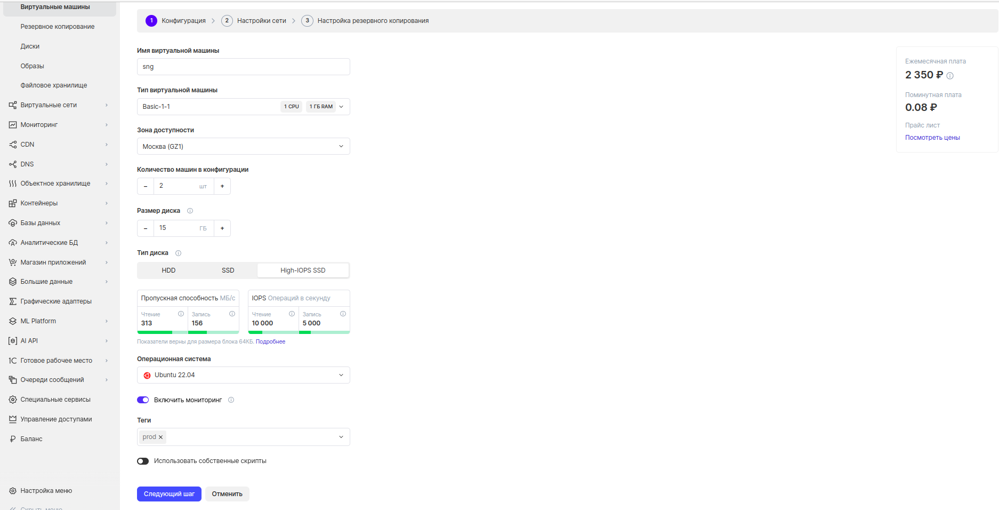
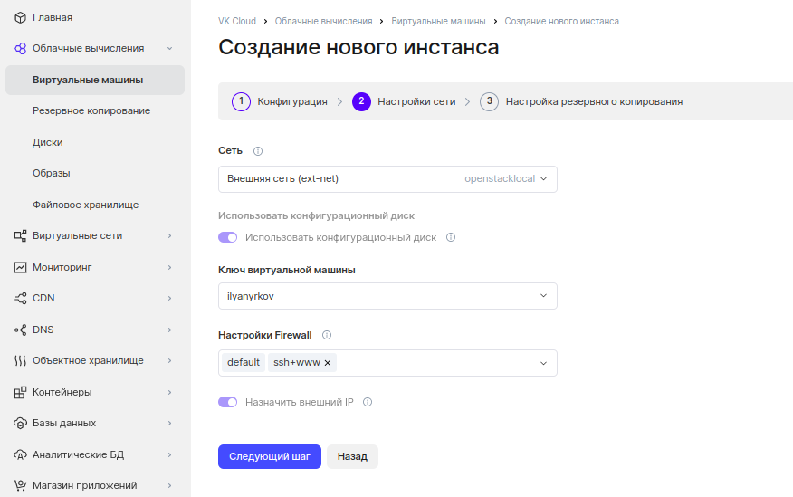
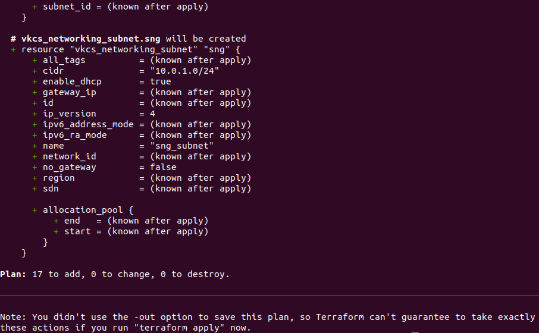

# Глава 1: Использование инфраструктуры как сервис

## Часть 1: Создание виртуальной машины

описание цен: https://mcs.mail.ru/pricing/?services=servers

0) Переходим в раздел **Облачные вычисления -> виртуальные машины**

1) Здесь укажем имя виртуальной машины (далее вм). Назовём её "sng".

2) Укажем тип или flavor (в терминах Openstack) вм. Например Basic-1-1.
Есть несколько групп типов вм, они описаны в [документации](https://mcs.mail.ru/docs/base/iaas/vm-start/vm-quick-create#shablony-konfiguraciy). Помимо стандартных флейворов можно запросить свои типы у техподдержки.

3) Указываем одну из зон доступности (датацентров), где будет размещена вм. Например **MS1**.

4) Указываем количество виртуальных машин, которые будут созданы в данной конфигурации. ВМ будут называться "имя-вм_<порядковый номер вм>". Укажем 2 вм (для использования в демо про виртуальные сети).

5) Устанавливаем размер диска в гигабайтах. Установим 15.

6) Указываем тип диска вм. Список типов дисков: https://mcs.mail.ru/docs/ru/base/iaas/vm-volumes/volume-sla. В случае надобности, у диска можно будет изменить тип. Мы укажем High-IOPS SSD. В зависимости от типа и размера диска меняется количество IOPS и пропускная способность.

7) Укажем операционную систему. Помимо списка стандартных образов, имеется возможность импорта своих образов или создание и использование образов из дисков. Мы выберем Ubuntu 22.04.

8) Включим мониторинг. Мониторинг позволит строит различные диаграммы (дашборды) и алерты, на основе различных метрик вм.

9) В разделе "Теги" добавим новый тег с любым именем. Теги позволяют помечать виртуальные машины, например к какому окружению они относятся: dev/stage/prod.

10) Использовать собственные скрипты. Мы отключим эту опцию.



11) Укажем сеть, к которой будет подключена вм. Можно указать созданную сеть или создать сеть при создании вм. Мы укажем **ext-net**, это внешняя сеть в проекте, с белыми ip-адресами имеющими доступ в интернет.

12) Укажем ssh-ключ, который будет добавлен в вм при её создании. Ключ должен быть типа rsa. Ключ можно импортировать или создать вместе с вм, в таком случае после создания вм будет скачан приватный ключи.

13) В настройках firewall укажем правила доступа по сети. Мы укажем ssh+www.

14) В случае, если бы мы указали в сети не ext-net, мы могли бы назначить внешний ip.



15) В плане бэкапирования ничего не выбираем. Нажимаем "создать инстанс".
После создания вм можно **перейти в панель управления**


где можно посмотреть:
* Общую информацию об инстансе и способ подключения по ssh или rdp (если вм на windows)
* Сети, к которым подключена вм
* Консоль, при помощи которой можно управлять вм из браузера, там же можно назначить пароль для вм
* Системные логи
* Метаданные, который выставляются у образа вм

16) Подключимся к вм по ssh, указав имя пользователя и адрес из панели управления вм.

Вернувшись в список виртуальных машин, мы можем прямо из списка выполнять операции с отдельными вм. 


Стоит отметить опции:
* Остановка вм - вм останавливается и не потребляет средства, кроме диска
* Обычная и принудительная перезагрузка
* Заблокировать вм - вм перестаёт быть доступной по сети и текущий сеанс администратора завершается

## Часть 2: Виртуальные сети

0) Переходим в раздел **Виртуальные сети**.

1) Перейдём в раздел **сети** и создадим сеть "sgn_net", также создадим для неё маршрутизатор. В разделе **Топология сети** можно посмотреть схему сети. По умолчанию в любом проекте имется сеть ext-net.

2) Перейдём в раздел **Настройки firewall** и создадим группу sng_ssh_www_extended. Далее описаваем порты и адреса с которых трафик будет разрешён, всё что не описано, не будет проходить.


В ней укажем правила на входящий трафик со следующими портами: 80, 443, 22, 8080. Также добавим все порты и протоколы на исходящий трафик:


В итоге получим следующую группу правил:


Далее созданную правил необходимо назначать на сетевые интерфейсы вм, чтобы она начала действовать:


3) Перейдём в раздел **Балансировщики** и создадим балансировщик. Балансировщик должен находится в одной сети с вм, между которыми будут балансироваться запросы. Также назначим ему внешний ip:


Добавим новое **правило балансировки**. Укажем алгоритм балансировки Round Robin и укажем там два ранее созданных инстанса.


Отправим запрос на внешний ip адрес балансировщика:

```shell
<html><body><h1>503 Service Unavailable</h1>
No server is available to handle this request.
</body></html>
```

Получаем следующий ответ, так как на созданных вм пока нету процесса, который отвечает на http запросы по 80 порту.

Установим на обе, созданные ранее вм, веб-сервер nginx:

```bash
sudo apt-get update
```

```bash
sudo apt install nginx
```

Подменим index.html на каждой из вм

```bash
sudo nano /var/www/html/index.nginx-debian.html 
```

Проверим, что новый index.html был применён:

```bash
curl localhost
```

Проверим работу балансировщика, отправив запрос на его внешний ip:

```bash
curl <адрес load balancer>
```

Так как мы используем алгоритм балансировки Round Robin, ответы от 1 и 2 вм будут чередоваться.

4) Перейдём в раздел **VPN**. Здесь можем просматривать и настраивать site-to-site vpn каналы. VPN каналы можно строить между проектом vk cloud и внешней инфраструктурой или между двумя проектами vk cloud (что является одним из способов связать 2 изолированных проекта в vk cloud).

https://mcs.mail.ru/docs/ru/networks/vnet/use-cases/vpn-tunnel

5) Перейдём в раздел **Маршрутизаторы**. Найдём маршрутизатор, к которому подключена наша сеть "sng_net" и перейдём в его описание. Здесь можно посмотреть общую информацию, интерфейсы, прописать статические маршруты.


6) Перейдём в раздел **Плавающие IP**. Здесь можно посмотреть список используемых публичных ip и каким внутренним адресам они привязаны. В случае необходимости к публичному ip можно привязать другой локальный ip.


## Часть 3: Шаблонизация и инфраструктура как код

В прошлых главах мы рассмотрели основные ресурсы, которые можно создавать в IaaS. Мы создавали их через графический интерфейс, который удобен, однако любые механические операции выполняемые человеком могут привести к ошибкам и эту проблему решает IaC.

1) Устанавливаем terraform с [официального сайта](https://developer.hashicorp.com/terraform/downloads) или [зеркала vk cloud](https://hub.mcs.mail.ru/repository/terraform-binary/mirror/latest/).

2) Переходим в папку 1.IaaS/terraform и инициализируем терраформ командой:

```bash
terraform init
```

3) Для доступа к API облака VK, нужно аутентифицироваться через .rc файл, его можно скачать в личном кабинете vk cloud:


также перед этим добавим в него эти строчки:

```shell
export TF_VAR_username=$OS_USERNAME
export TF_VAR_password=$OS_PASSWORD
export TF_VAR_projectid=$OS_PROJECT_ID
```

Приставка TF_VAR_ позволяет извлекать терраформу значения его переменных из переменных окружения. (Шаг с добавлением переменных окружения rc файл не обязателен, можно экспортировать их в отдельном скрипте или каждый раз вручную).

Применим .rc файл:

```bash
source <название файла>.rc
```

4) Перед применением файлов терраформа можно посмотреть, что терраформ изменит, выполнив команду:

```bash
terraform plan
```

Получим вывод:



5) Для применения конфигурационных файлов воспользуемся командой:

```bash
terraform apply --auto-approve
```

Запустился процесс создания:


6) После создания попробуем отправить curl-запрос на внешний ip балансировщика:
 
```bash
curl <внешний ip балансировщика>
```

и не получаем ответа, так как балансировщик обращается к вм, на которых не установлен и не запущен nginx

```shell
<html><body><h1>503 Service Unavailable</h1>
No server is available to handle this request.
</body></html>
```

7) Заходим на каждую вм и устанавливаем nginx, проверяем работоспособность. 

```bash
curl <адрес балансировщика>
```

8) Удаляем инфраструктуру

```bash
terraform destroy --auto-approve
```

## Terraform + Packer

Вместо того, чтобы поднимать инфраструктуру и ставить вручную программное обеспечение (далее ПО) на каждую машину, мы можем заранее подготовить образ с установленным ПО. Этот подход называется Golden Image.

9) Установим packer. Подробнее про установку и работу packer и vk cloud в [документации](https://mcs.mail.ru/docs/ru/base/iaas/vm-images/packer)

10) Соберём образ, воспользовавшись конфигурационным файлом nginx.pkr.hcl
```
packer build nginx.pkr.hcl
```

11) Посмотрим созданный образ в интерфейсе облака


Также образ можно посмотреть в cli командой:

```bash
openstack image list | grep nginx-1.0.0
```

12) Отредактируем файл в terraform и укажем созданный нами образ в файле base.tf, секции vkcs_compute_flavor compute.

13) Развернём инфраструктуру

```bash
terraform apply
```

14) Отправим запрос на балансировщик и получим ответ

```bash
curl <адрес балансировщика>
```

Дополнительно про terraform можно прочитать в [статье](https://habr.com/ru/company/vk/blog/659183/).

Документация по terraform-провайдеру vk cloud:
* [Cайт hashicorp](https://registry.terraform.io/providers/vk-cs/vkcs/latest/docs).
* [github-репозиторий](https://github.com/vk-cs/terraform-provider-vkcs/tree/master/docs). Стоит обратить внимание на папку examples, в ней есть примеры разворачивания практически всех ресурсов vk cloud через terraform.
* [Раздел про terraform](https://mcs.mail.ru/docs/ru/manage/terraform) в официальной документации vk cloud.

## Часть 4: Объектное хранилище s3 

0) Перейдём в раздел **Объектное хранилище**, то есть s3 хранилище. 

1) Создадим ключ доступа для доступа к бакетам.


Имеется два типа бакетов в s3, которые отличаются оплатой:
* icebox - дешёвое хранение, дорогой трафик
* hotbox - дорогое хранение, дешёвый трафик

2) Создадим бакет типа hotbox 

!!! Добавить блок про графический интерфейс s3

## Работа с s3 vk cloud при помощи терминала

3) Подключим aws cli (укажем 2 ключа доступа)

```bash
aws configure
```

Указываем данные созданного s3-ключа, регион, формат вывода:

```shell
aws configure
AWS Access Key ID [****************Q8G7]: 
AWS Secret Access Key [****************m15o]: 
Default region name [ru-msk]: ru-msk
Default output format [text]: text
```

4) Создадим бакет hotbox через cli:

```bash
aws s3 mb s3://sng_hotbox --endpoint-url http://hb.bizmrg.com
```

5) Создадим бакет icebox через cli:

```bash
aws s3 mb s3://sng_icebox --endpoint-url http://ib.bizmrg.com
```

6) Просмотр списка бакетов:

```bash
aws s3 ls --endpoint-url http://ib.bizmrg.com
```

7) Изменение класса хранения бакета в hotbox

```bash
aws s3api create-bucket --bucket sng_icebox --endpoint-url http://hb.bizmrg.com --cli-input-json "{\"Bucket\": {\"storage-class\": \"hotbox\"}}"
```

Данная команда позволит автоматизировать изменения типа бакета в случае роста нагрузки или наоборот падения, позволяя дополнительно экономить.

8) Изменение класса хранения бакета в icebox

```bash
aws s3api create-bucket --bucket sng_icebox --endpoint-url http://ib.bizmrg.com --cli-input-json "{\"Bucket\": {\"storage-class\": \"icebox\"}}"
```

9) Загрузка файла

```bash
aws s3 cp ./terraform/variables.tf s3://sng_icebox --endpoint-url http://hb.bizmrg.com
```

10) Просмотр содержимого бакета

```bash
aws s3 ls s3://sng --endpoint-url http://hb.bizmrg.com
```

11) Скачивание объекта

```bash
aws s3 cp s3://sng_hotbox/terraform/variables.tf ./ --endpoint-url http://hb.bizmrg.com
```

12) Удаление объекта

```bash
aws s3 rm s3://sng_hotbox/terraform/variables.tf --endpoint-url http://hb.bizmrg.com
```

## Префиксные ключи

В s3 нету директорий, они имитируются префиксами, разделяемыми слешами. Префиксные ключи позволяют ограничить для различных пользователей api доступ к бакету на уровне префикса.

13) Создадим ключи:

* для юзера terraform (префикс terraform)

* для юзера user1 (префикс terraform/user1)

* ключи для юзера user1 (префикс terraform/user2)

* проверяем доступы с разных ключей, просматрев список объектов в бакете на каждом:

```bash
aws s3 ls s3://sng --endpoint-url http://hb.bizmrg.com
```
